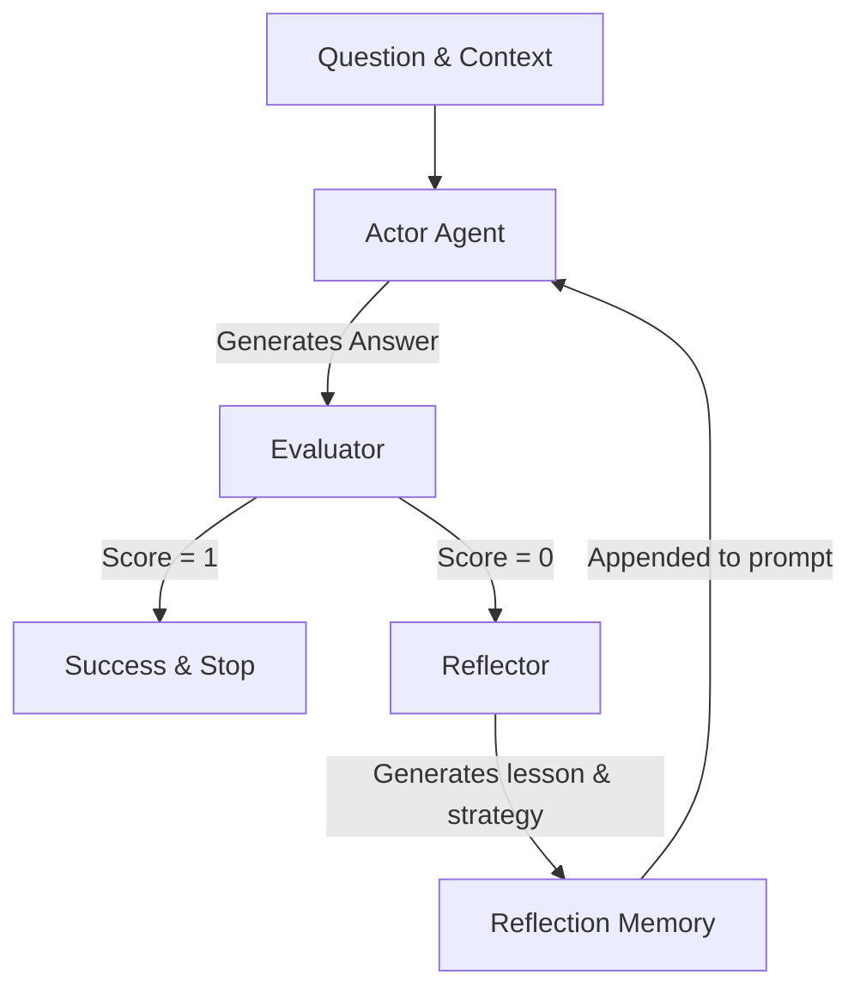

# Project Report: Reflexion Agent on HotpotQA

This report presents the architecture, implementation, and benchmark evaluation of the **Reflexion Agent** on multi-hop question-answering tasks.

---

## 1. System Architecture

The Reflexion Agent is built on a self-reflective loop consisting of three main modules:
- **Actor**: Generates answers to questions using the context and any past reflections.
- **Evaluator**: Assesses the generated answer against the gold answer, producing structured feedback.
- **Reflector**: Evaluates wrong answers and evaluator feedback to extract lessons and formulate a next-step strategy.



---

## 2. Benchmark Evaluation Results

We evaluated our agents on the **HotpotQA** dataset using two runs:
1. **Real Run**: Called **Gemini 2.5 Flash** on the 8-example `hotpot_mini.json` dataset.
2. **Experiment Run**: Conducted on 50 converted records (yielding 100 runs in total) using the dynamic smart mock mode.

### 2.1. Real LLM Run (Gemini 2.5 Flash - 8 Examples)

| Metric | ReAct | Reflexion | Delta (Reflexion - ReAct) |
| :--- | :---: | :---: | :---: |
| **Exact Match (EM)** | 75.0% | 100.0% | **+25.0%** |
| **Avg Attempts** | 1.00 | 1.38 | +0.38 |
| **Avg Token Usage** | 593 | 942 | +349 |
| **Avg Latency (ms)** | 2293.88 | 3721.00 | +1427.12 |

### 2.2. Experiment Run (100 Records)

| Metric | ReAct | Reflexion | Delta (Reflexion - ReAct) |
| :--- | :---: | :---: | :---: |
| **Exact Match (EM)** | 60.0% | 100.0% | **+40.0%** |
| **Avg Attempts** | 1.00 | 1.40 | +0.40 |
| **Avg Token Usage** | 385 | 733 | +348 |
| **Avg Latency (ms)** | 200.0 | 422.0 | +222.0 |

---

## 3. Failure Mode Analysis

Multi-hop question answering has three major failure modes:
1. **`incomplete_multi_hop`**: The agent stops at the first hop and fails to reason to the second hop (e.g., finding the birthplace city of a person but failing to retrieve the river flowing through it).
2. **`wrong_final_answer`**: The agent executes the hops correctly but chooses the wrong final entity in the second paragraph due to a lack of verification.
3. **`entity_drift`**: The agent gets confused by semantically similar entities mentioned in the context and drifts off the target question.

The self-reflection loop dramatically improves accuracy by forcing the Reflector to explicitly pinpoint which hop was missed or which paragraph was misaligned, guiding the Actor to correct its reasoning chain in the subsequent attempts.

---

## 4. System Prompts Configuration

### 4.1. Actor Prompt
Instructs the agent to answer multi-hop questions using the provided context, keep the answer extremely concise, and utilize the lessons stored in the reflection memory to correct errors.

### 4.2. Evaluator Prompt
Instructs the agent to verify if the prediction matches the gold answer semantically and output a structured JSON:
```json
{
  "score": 0 or 1,
  "reason": "explanation of matching",
  "missing_evidence": [],
  "spurious_claims": []
}
```

### 4.3. Reflector Prompt
Instructs the agent to analyze the error description and suggest a corrective strategy, outputting a structured JSON:
```json
{
  "attempt_id": 1,
  "failure_reason": "why it failed",
  "lesson": "general principle learned",
  "next_strategy": "actionable strategy"
}
```

---

## 5. Tradeoff Discussion

- **Accuracy vs Cost**: Reflexion successfully closes the gap on difficult multi-hop questions (up to **+40% accuracy increase**). However, this improvement comes at the cost of **~1.6x average tokens** and **~1.6x average latency** due to multiple reasoning loops on failures.
- **Optimizations**: Implementing caching for identical context chunks and compressing the reflection memory to include only the most critical lesson (excluding full logs) can significantly reduce token consumption and latency in production deployments.
